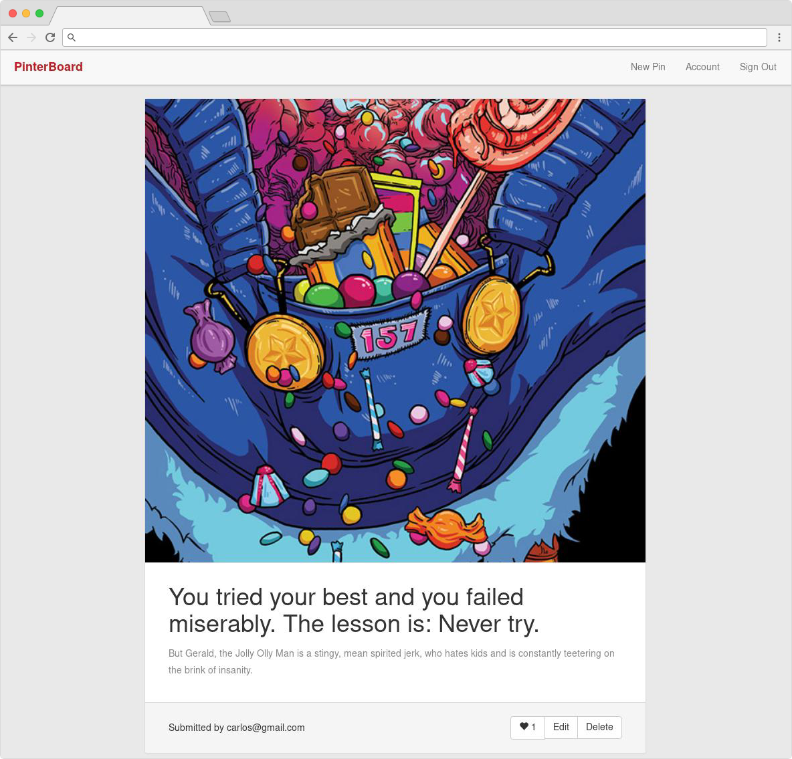

# Pinterboard an Pinterest Clone

## Instructions:

1. clone the repo `git clone git@github.com:carlosgomez2/pinterboard.git`
2. cd into repo folder and run `bundle`
3. run `bundle exec rake db:seed && rails server`
4. browse `localhost:3000`
5. login as: *carlos@gmail.com*, password: *password*

## Screenshots

